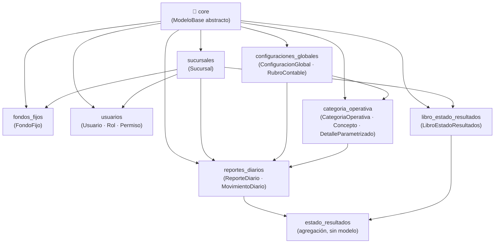

# APEX-TON — Diagrama Entidad-Relación

> Muestra todas las tablas del backend, sus campos clave y las relaciones entre ellas.  
> Los campos heredados de `ModeloBase` se omiten por brevedad (ver `api_reference.md`).  
> Renderizable en cualquier visor de Mermaid (GitHub, VS Code, Notion, etc.)

---

## Diagrama completo

```mermaid
erDiagram

    %% ─────────────────────────────────────────
    %%  TABLAS MAESTRAS GLOBALES
    %% ─────────────────────────────────────────

    configuraciones_globales {
        int     id              PK
        string  clave           UK "TIPO_CAMBIO_USD, HORARIO_APERTURA..."
        text    valor
        string  tipo_valor         "STRING|INT|FLOAT|BOOLEAN|DATE|TIME|DATETIME|JSON"
        text    descripcion
    }

    rubro_contable {
        int     id              PK
        string  nombre          UK
        string  padre              "INGRESOS|GASTOS|JUEGO_VIVO|..."
        string  tipo               "INGRESO|EGRESO"
        text    descripcion
    }

    %% ─────────────────────────────────────────
    %%  SUCURSALES Y FONDOS FIJOS
    %% ─────────────────────────────────────────

    sucursales {
        int     id              PK
        string  nombre          UK
        string  clave           UK "MOR-01"
        text    direccion
        string  ciudad
        string  estado_republica
        string  telefono
        string  correo
        string  encargado
        decimal fondo_inicial
    }

    fondos_fijos {
        int     id              PK
        int     sucursal_id     FK "1:1 con sucursales"
        decimal monto_autorizado
        decimal saldo_actual
        string  moneda             "MXN|USD"
        text    observaciones
    }

    %% ─────────────────────────────────────────
    %%  USUARIOS Y CONTROL DE ACCESO
    %% ─────────────────────────────────────────

    usuarios {
        int     id              PK
        string  username        UK
        string  nombre
        string  correo
        int     sucursal_id     FK "nullable - null = usuario global"
        bool    is_active
        bool    is_staff
        datetime creado_en
        datetime actualizado_en
    }

    roles {
        int     id              PK
        string  nombre          UK "ADMINISTRADOR|GERENTE|CONTADOR|DIRECTOR"
        text    descripcion
    }

    permisos {
        int     id              PK
        string  codigo          UK "MODULO_ACCION"
        string  nombre
        string  modulo
        text    descripcion
    }

    usuarios_roles {
        int     id              PK
        int     usuario_id      FK
        int     rol_id          FK
        datetime asignado_en
    }

    roles_permisos {
        int     id              PK
        int     rol_id          FK
        int     permiso_id      FK
    }

    %% ─────────────────────────────────────────
    %%  ESTRUCTURA OPERATIVA
    %% ─────────────────────────────────────────

    categorias_operativas {
        int     id              PK
        string  nombre          UK "ADMINISTRACION|BOOK|DOLARES|..."
        string  clave           UK "ADMIN|BOOK|..."
        text    descripcion
        string  tipo               "INGRESO|EGRESO|MIXTO"
        int     orden
    }

    conceptos {
        int     id              PK
        int     categoria_id    FK
        int     rubro_contable_id FK
        string  nombre
        string  clave           UK "ADMIN_VENTA_CAFE"
        string  tipo               "INGRESO|EGRESO"
        text    descripcion
        bool    es_recurrente
    }

    detalles_parametrizados {
        int     id              PK
        int     categoria_id    FK
        string  nombre
        string  clave              "snake_case"
        string  tipo_valor         "TEXT|DECIMAL|INT|BOOLEAN|DATE|DATETIME"
        bool    requerido
        string  valor_defecto
        text    descripcion
    }

    %% ─────────────────────────────────────────
    %%  REPORTES Y MOVIMIENTOS
    %% ─────────────────────────────────────────

    reportes_diarios {
        int     id              PK
        int     sucursal_id     FK
        date    fecha_contable     "SIEMPRE D-1 (calculado por backend)"
        string  estado_reporte     "ABIERTO|CERRADO"
        decimal saldo_arrastre_inicio
        decimal saldo_arrastre_fin
        decimal tipo_cambio_usd_snapshot
        decimal tipo_cambio_eur_snapshot
        decimal total_ingresos
        decimal total_egresos
        decimal resultado_neto
        datetime cerrado_en
        int     cerrado_por_id  FK "nullable → usuarios"
        text    observaciones
    }

    movimientos_diarios {
        int     id              PK
        int     reporte_id      FK "asignado automáticamente por backend"
        int     concepto_id     FK
        decimal monto              "siempre positivo en MXN"
        decimal monto_divisa       "nullable - para USD/EUR"
        string  tipo_divisa        "nullable - USD|EUR"
        json    detalles_snapshot  "snapshot de detalles parametrizados"
        text    notas
    }

    %% ─────────────────────────────────────────
    %%  LIBRO HISTÓRICO MENSUAL
    %% ─────────────────────────────────────────

    libro_estado_resultados {
        int     id              PK
        int     sucursal_id     FK
        int     anio
        int     mes
        string  estado_mes         "ABIERTO|CERRADO"
        decimal tipo_cambio_usd_snapshot
        decimal tipo_cambio_eur_snapshot
        decimal total_ingresos
        decimal total_egresos
        decimal resultado_neto
        decimal saldo_arrastre_inicio
        decimal saldo_arrastre_fin
        json    desglose_por_rubro "snapshot inmutable al cierre"
        datetime cerrado_en
        int     cerrado_por_id  FK "nullable → usuarios"
        text    observaciones
    }

    %% ─────────────────────────────────────────
    %%  RELACIONES
    %% ─────────────────────────────────────────

    %% Sucursales ↔ Fondos Fijos (1:1)
    sucursales        ||--||  fondos_fijos            : "tiene"

    %% Usuarios ↔ Sucursal (N:1, opcional)
    sucursales        ||--o{  usuarios                : "pertenecen a"

    %% Usuarios ↔ Roles (N:M via tabla intermedia)
    usuarios          ||--o{  usuarios_roles          : "tiene"
    roles             ||--o{  usuarios_roles          : "asignado a"

    %% Roles ↔ Permisos (N:M via tabla intermedia)
    roles             ||--o{  roles_permisos          : "tiene"
    permisos          ||--o{  roles_permisos          : "asignado a"

    %% Categorías ↔ Conceptos (1:N)
    categorias_operativas  ||--o{  conceptos               : "agrupa"

    %% Rubros ↔ Conceptos (1:N)
    rubro_contable        ||--o{  conceptos               : "clasifica"

    %% Categorías ↔ Detalles Parametrizados (1:N)
    categorias_operativas  ||--o{  detalles_parametrizados  : "extiende con"

    %% Sucursales ↔ Reportes Diarios (1:N)
    sucursales            ||--o{  reportes_diarios          : "genera"

    %% Reportes ↔ Movimientos (1:N)
    reportes_diarios      ||--o{  movimientos_diarios       : "contiene"

    %% Conceptos ↔ Movimientos (1:N)
    conceptos             ||--o{  movimientos_diarios       : "clasifica"

    %% Sucursales ↔ Libro Mensual (1:N)
    sucursales            ||--o{  libro_estado_resultados   : "registra"

    %% Usuarios como responsables de cierre
    usuarios              ||--o{  reportes_diarios          : "cierra"
    usuarios              ||--o{  libro_estado_resultados   : "cierra"
```

---

## Leyenda de relaciones

| Notación | Significado |
|---|---|
| `\|\|--\|\|` | Uno a Uno (1:1) |
| `\|\|--o{` | Uno a Muchos (1:N) |
| `o{--o{` | Muchos a Muchos (N:M) |

---

## Jerarquía de dependencias entre apps

---

## Notas de diseño importantes

1. **Soft-Delete universal:** Ningún registro se elimina físicamente. `ModeloBase.delete()` siempre ejecuta `eliminar_logico()`.
2. **T-1 forzado:** El backend calcula `fecha_contable = hoy - 1 día`. El frontend no puede sobreescribir esto.
3. **Snapshots inmutables:** `tipo_cambio_usd_snapshot`, `tipo_cambio_eur_snapshot` y `desglose_por_rubro` en `LibroEstadoResultados` son fotos fijas del momento del cierre. Cambios posteriores en `ConfiguracionGlobal` **no** los afectan.
4. **Permisos por Rol:** Nunca se asignan permisos directamente a un usuario. Siempre a través de `Rol → RolPermiso → Permiso`.
5. **Encadenamiento de saldos:** `saldo_arrastre_inicio` de cada `ReporteDiario` se obtiene del `saldo_arrastre_fin` del reporte anterior de la misma sucursal (automático al crear).
