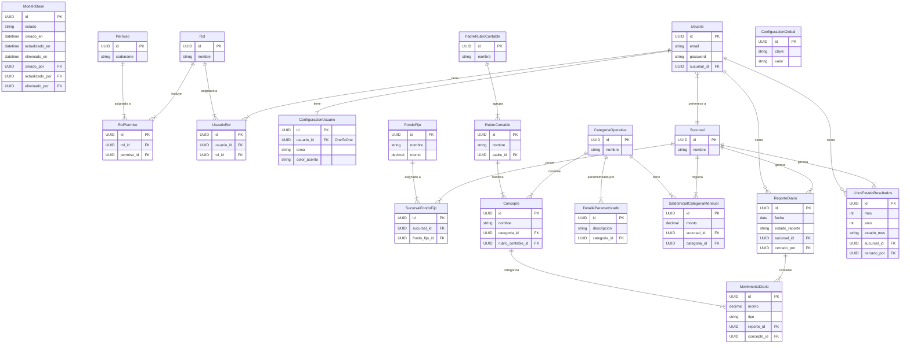

# Diagrama Entidad-Relación (ER) - APEX-TON Backend

El siguiente diagrama muestra las entidades principales del sistema y sus relaciones. 

> **Nota**: Casi todos los modelos del sistema heredan de `ModeloBase`, el cual incluye campos de auditoría (`creado_por`, `actualizado_por`, `eliminado_por` relacionados al modelo `Usuario`), campos de fecha (`creado_en`, `actualizado_en`, `eliminado_en`) y un estado lógico (`estado`). Por simplicidad visual, estas relaciones de auditoría hacia `Usuario` se omiten en la mayoría de las entidades, enfocándose en las reglas del negocio.

